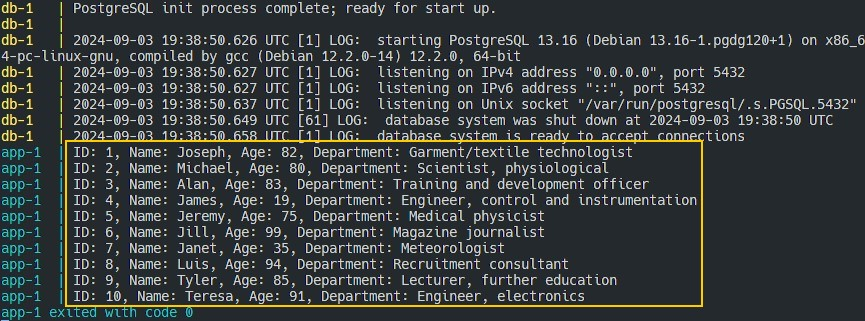

# Итоговая аттестация. Задание 2

Торшин Сергей

### Запуск 

1. Загрузить репозиторий
    ```bash
    git clone https://github.com/torshin5ergey/1tdata-do_2024-08-28_6.11-02.git
    ```
2. Перейти в директорию репозитория
    ```bash
    cd 1tdata-do_2024-08-28_6.11-02
    ```
3. Запустить мультиконтейнерное приложение
    ```bash
    docker compose up
    ```

Результат выполнения задания показан на рисунке ниже.


Ссылка на образ с Python-приложением в Docker Hub: [torshin5ergey/1tdata-do_2024-08-28_6.11-02-app](https://hub.docker.com/repository/docker/torshin5ergey/1tdata-do_2024-08-28_6.11-02-app/general)
